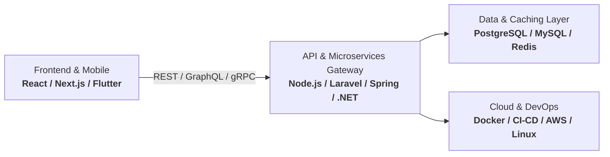

  # 👨‍💻 John Joshua
  ### **Senior Fullstack Software Engineer & Solutions Architect**
  Transforming complex business challenges into resilient, high-performance web, mobile, and cloud architectures.

   

  

   

  
  
  
  

---

## 📌 Executive Summary / Resumo Executivo

**🇬🇧 English:**  
Senior Fullstack Software Engineer and Technical Founder with a proven track record of designing, building, and deploying end-to-end distributed systems, multiplatform mobile applications, and enterprise web solutions. Specialized in building clean, decoupled architectures (SOLID, Clean Architecture, DDD) across diverse ecosystems (**Node.js/TypeScript, Laravel, Spring Boot, .NET, Python, and Flutter**). Experienced in leading technical initiatives, establishing robust CI/CD pipelines, and delivering high-availability cloud solutions that align directly with business goals.

**🇧🇷 Português:**  
Engenheiro de Software Fullstack Sênior e Empreendedor de Tecnologia com sólida experiência no desenvolvimento de sistemas distribuídos ponta a ponta, aplicativos mobile multiplataforma e soluções corporativas escaláveis. Especialista em arquiteturas desacopladas e resilientes (SOLID, Clean Architecture, DDD) atuando nos ecossistemas **Node.js/TypeScript, Laravel, Spring Boot, .NET, Python e Flutter**. Foco comprovado em liderança técnica, automação DevOps/CI-CD e entrega de produtos de alto impacto.

---

## 🏛️ Engineering Pillars & Architecture

- **Clean Code & Architecture**: Domain-Driven Design (DDD), Modular Monoliths & Microservices, Design Patterns, SOLID Principles & Test-Driven Development (TDD).
- **Scalability & Performance**: Caching strategies (Redis), asynchronous queues, database query optimization, and lazy-loading frontends.
- **Enterprise Security**: Role-Based Access Control (RBAC), OAuth2 / JWT authentication, data encryption, and OWASP best practices.
- **Continuous Delivery**: Fully automated CI/CD pipelines, automated testing, containerization with Docker, and cloud orchestrations.

---

## 🛠️ Technical Arsenal

<b>⚡ Languages & Core Runtimes</b>

 

<b>🌐 Frontend & Mobile Engineering</b>

 

<b>⚙️ Backend, APIs & Frameworks</b>

 

<b>🗄️ Database, Caching & Message Brokers</b>

 

<b>🚀 DevOps, Cloud & Infrastructure</b>

 

---

## 💼 Featured Engineering & Production Systems

| Project | Domain / Scope | Tech Stack | Architectural Highlights |
| :--- | :--- | :--- | :--- |
| **[Central-Academica](https://github.com/SingeloDux/Central-Academica)** | Academic Management Platform | `PHP` `Laravel` `MySQL` `Blade` | Built scalable modular architecture, role management (RBAC), student records automation, and report pipelines. |
| **Print4You Ecosystem: StockManager** | Enterprise Mobile Inventory | `Flutter` `Dart` `REST API` | Real-time barcode & stock tracking with offline synchronization and optimized data storage. |
| **Print4You Ecosystem: Portal Stock** | Web Analytics & Inventory Hub | `React` `Node.js` `PostgreSQL` | High-throughput inventory control dashboard with real-time stock status and transaction logs. |
| **Print4You Ecosystem: Mobile & Web Toolkit** | Cross-Platform Operations Suite | `Flutter` `TypeScript` `Docker` | Unified operational toolkit providing seamless workflows between field operators and management. |
| **Joshua Solution Development** | Enterprise Tech Solutions | `Fullstack Multi-Cloud` | Technical leadership, client systems architecture, software engineering consultancy & custom platform delivery. |

---

## 📊 Engineering Analytics & Activity

  
  

 

  
  

 

  

---

## 🤝 Let's Connect & Collaborate / Vamos Conversar

Whether you're looking for a **Senior Fullstack Engineer**, **Technical Lead**, or strategic **Software Architecture Consulting**, let's build something remarkable together!

 

 

💡 *"Simplicity is prerequisite for reliability."* — Edsger W. Dijkstra

