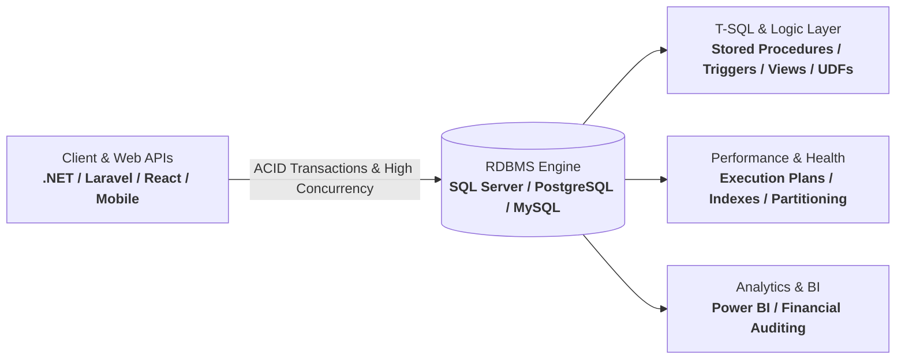

  # 👨‍💻 Josué Sitoe (John Joshua)
  ### **Software Developer | Full-Stack · .NET & Web APIs · SQL Server · Sistemas Empresariais · DBA**
  5+ years developing enterprise systems, high-throughput Web APIs, robust database architectures (SQL Server, PostgreSQL, MySQL), and multiplatform applications.

   

  

   

  
  
  
  
  

---

## 📌 Executive Summary / Resumo Profissional

**🇬🇧 English:**  
Full-Stack Software Engineer and Certified Database Administrator (DBA - IFRS) with over **5 years of hands-on experience** developing enterprise systems, mission-critical Web APIs, and multiplatform software. Deeply specialized in relational database engineering (**Microsoft SQL Server, PostgreSQL, MySQL**), data modeling, complex query tuning, transaction integrity (ACID), and implementing financial-grade audit trails with **T-SQL, Stored Procedures, and Triggers**. Solid backend experience across **C# / .NET (ASP.NET Core), PHP / Laravel, Python, and Java**, alongside modern interfaces with **React, Flutter, and TypeScript**. Proven track record building operational dashboards in **Power BI** and automating workflows with **Power Automate & Copilot Studio**.

**🇧🇷 Português:**  
Desenvolvedor de Software Full-Stack e Administrador de Banco de Dados Certificado (DBA - IFRS) com mais de **5 anos de experiência prática** no desenvolvimento de sistemas corporativos, plataformas Web, APIs RESTful e aplicativos multiplataforma. Forte domínio em engenharia de dados relacionais (**Microsoft SQL Server, PostgreSQL, MySQL**), modelagem de dados (DER/MER), otimização avançada de queries, integridade transacional e controle de auditoria financeira com **T-SQL, Stored Procedures e Triggers**. Sólida experiência em arquiteturas backend com **C# / .NET (ASP.NET Core), PHP / Laravel, Python e Java**, interfaces modernas com **React e Flutter**, além de relatórios analíticos em **Power BI** e automação de processos corporativos.

---

## 🗄️ Database Architecture & DBA Mastery (Bancos de Dados & DBA)

- **Advanced Database Programming (T-SQL & PL/pgSQL)**: Implementation of complex business logic directly at the database engine level using Stored Procedures, Triggers, Views, CTEs, and User-Defined Functions for transaction control and real-time data audit.
- **Performance Tuning & Optimization**: Execution Plan analysis, index defragmentation, index design strategies (Clustered, Non-Clustered, Covering, Filtered Indexes), query refactoring, deadlock resolution, and statistics maintenance.
- **Data Modeling & Architecture**: Conceptual, Logical, and Physical Data Modeling (DER/MER), relational normalization (1NF through 3NF), foreign key cascading policies, and constraint validations.
- **Transactional Reliability & Security**: ACID compliance, transaction isolation levels, concurrency management, automated backup strategies, disaster recovery routines, and fine-grained data permissions.
- **Business Intelligence & Analytics**: Extraction of business metrics, real-time KPI reporting, financial transaction auditing, and executive dashboards using **Microsoft Power BI**.

---

## 🛠️ Technical Arsenal

<b>🗄️ Database Systems, DBA & Data Engineering</b>

 

-2496ED?style=flat-square&logo=diagram&logoColor=white)

<b>⚙️ Backend, APIs & Distributed Architecture</b>

 

<b>🌐 Frontend, Mobile & UI/UX</b>

 

<b>🚀 DevOps, Infrastructure, Cloud & Automation</b>

 

---

## 💼 Featured Engineering & Production Systems (Projetos em Destaque)

| Project / System | Architecture & Scope | Tech Stack | Key Database & Engineering Highlights |
| :--- | :--- | :--- | :--- |
| **Portal de Pedidos & Workflow (Print4You)** | Enterprise Order & Workflow Control System | `C#` `.NET` `SQL Server` `Laravel` `REST APIs` | Team workflow automation with **T-SQL Triggers & Stored Procedures** in SQL Server, complete transactional auditability and real-time event notifications. |
| **Enterprise Web APIs & Módulo de Serviços** | Layered Backend & Relational Persistence | `C#` `ASP.NET Core` `SQL Server` `T-SQL` | Robust layered API architecture with business rule validations, transactional persistence, and microservices integration. |
| **APPStock (Print4You)** | Real-Time Inventory & Auditing Hub | `C#` `.NET` `SQL Server` `MySQL` `REST API` | Stock movements audit module, historical logs, minimum stock alert triggers, and high-performance relational queries. |
| **Credium Smart (CodeForge Dev)** | Financial SaaS Microcredit & Amortization | `PHP` `Laravel` `MySQL` `PostgreSQL` `REST APIs` | Financial calculation engine with strict interest rate amortizations, transactional audit trails, and multi-tenant persistence. |
| **Módulo de Gestão Acadêmica (CodeForge / Central)** | Academic & Student Records Automation | `Python` `PHP` `Laravel` `MySQL` `Microservices` | Comprehensive student lifecycle management, automated report generation, RBAC security, and decoupled microservices. |
| **Business Intelligence & Analytics Hub** | Operational & Financial Reporting Suite | `Power BI` `SQL Server` `DAX` `ETL` | Real-time executive dashboards, automated financial auditing pipelines, and operational health monitoring. |
| **Joshua Solution Development Ecosystem** | Multi-tenant SaaS & AI Solutions | `C#` `PHP` `JavaScript` `AI APIs` `SQL Server` | Technical founder delivering custom platforms, including SaaS booking systems (*Lavagem Auto*) and AI Text-to-Speech platforms (*Ouvir Texto*). |

---

## 📜 Certifications & Continuous Learning

- 🎓 **Engenharia de Software (Informática Aplicada)** — Universidade Pedagógica de Maputo *(Graduando)*
- 🏛️ **Administrador de Banco de Dados (DBA)** — Instituto Federal de Educação, Ciência e Tecnologia (IFRS) *(200 Horas · 2025)*
- ⚡ **Automação de Sistemas** — IFRS *(30 Horas · 2026)*
- 🤖 **AI Fluency: Framework & Foundations** — Anthropic *(2026)*
- 🔄 **Copilot Studio · Planner · Power Automate** — Microsoft *(2026)*
- 💻 **Informática Avançada e Programação Web** — Unitec Academy *(2024)*

---

## 📊 Engineering Analytics & Activity

  
  

 

  
  

 

  

---

## 🤝 Let's Connect & Collaborate / Vamos Conversar

Whether you're looking for a **Full-Stack Software Developer**, **Database Administrator (DBA)**, or **Enterprise Systems Engineer**, let's build robust solutions together!

 

 

💡 *"Simplicity is prerequisite for reliability."* — Edsger W. Dijkstra

